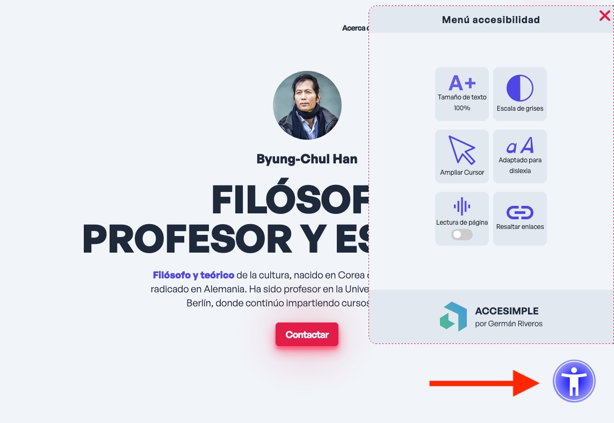

# Accesimple Adaptativo 

## Introducción

**Accessimple Adaptativo** es un widget de accesibilidad de código abierto que proporciona funciones esenciales para mejorar la experiencia de navegación de los usuarios con discapacidad. A diferencia de otras soluciones, este plugin se ofrece como una solución adapta al diseño de la página web en la que se implementa, respetando su esquema de colores y estilos.

## Características

Funcionalidades de accesibilidad:
  - Ajuste de tamaño de fuente.
  - Escala de grises.
  - Ampliar el cursor.
  - Adaptado para dislexia.
  - Lectura de página.
  - Resaltado de enlaces.
  - Menú de accesibilidad responsivo.
  - El sitio se optimizo para navegación con teclado.
  - Eliminación de animaciones para reducir distracciones.

## Implementación 

- La implementacion de **accesimple adaptativo** se esta realizando en la siguiente 👉 [página](https://portafolio-1-rust.vercel.app/).

### Experimentos:

El propósito de los experimentos fue para desarrollar el prototipo que finalmente se convirtio en el widget. 

|Experimentos realizados | Descripción| Estado |
|------------------------|------------|-------------|
|[Experimento 1](https://github.com/german-rs/accesibilidad/tree/main/Experimentos/experimento1)| Menú de accesibilidad    | Implementado |
|[Experimento 2](https://github.com/german-rs/accesibilidad/tree/main/Experimentos/experimento2)| Modificar tamaños de fuente | Implementado |
|[Experimento 3](https://github.com/german-rs/accesibilidad/tree/main/Experimentos/experimento3)| Claro-Oscuro y escala de grises | Implementado | 
|[Experimento 4](https://github.com/german-rs/accesibilidad/tree/main/Experimentos/experimento4)| Navegación operable por teclado | Implementado|
|[Experimento 5](https://github.com/german-rs/accesibilidad/tree/main/Experimentos/experimento5)| Cambio de fuente a Open Dyslexic | Implementado|
|[Experimento 6](https://github.com/german-rs/accesibilidad/tree/main/Experimentos/experimento6)| Alternar tamaño del cursor | Implementado|
|[Experimento 7](https://github.com/german-rs/accesibilidad/tree/main/Experimentos/experimento7)| Resaltar enlaces| Implementado|
|[Experimento 8](https://github.com/german-rs/accesibilidad/tree/main/Experimentos/experimento8)| Síntesis de voz| Implementado |
|[Experimento 9](https://github.com/german-rs/accesibilidad/tree/main/Experimentos/experimento9)| Aumentar interlineado| En proceso |

